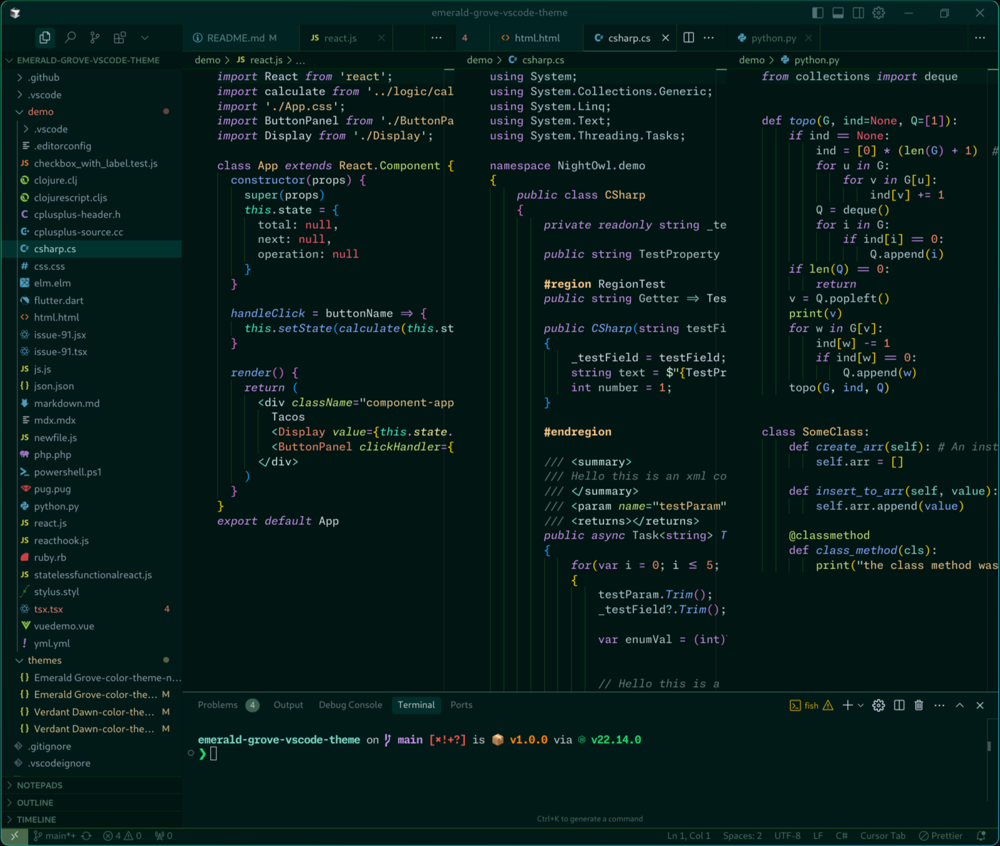
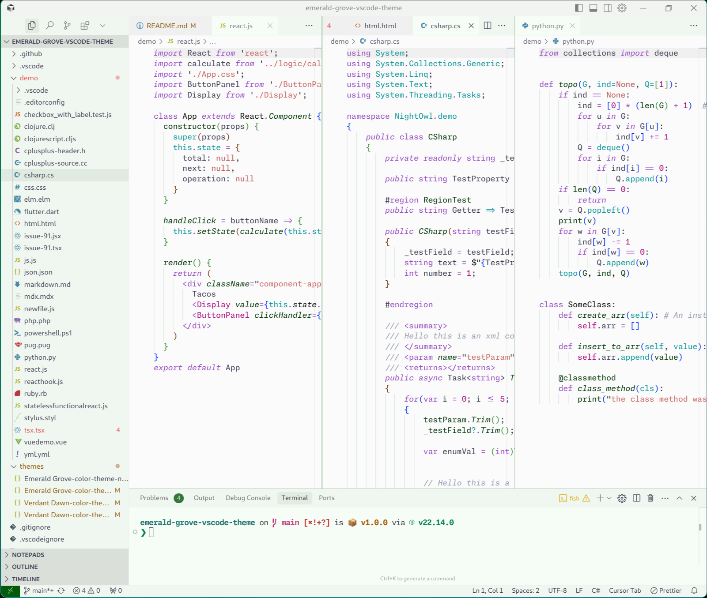

# Emerald Grove 🌲

Based on the fabulous [Night Owl](https://github.com/sdras/night-owl-vscode-theme) theme from Sarah Drasner.


[](https://vscode.dev/theme/topek.emerald-grove)


A Visual Studio Code theme for those who love the forest. Fine-tuned for those of us who like to code in nature. Color choices have taken into consideration what is accessible to people with colorblindness and in low-light circumstances. Decisions were also based on meaningful contrast for reading comprehension and for optimal razzle dazzle. ✨

As of 1.0.0, there's a Verdant Dawn theme too! Color balanced from the Dark version for easy viewing in daylight. 🌅

About this theme, and some of the considerations made while creating it (as well as _how_ to create it should you want to make your own): [https://css-tricks.com/creating-a-vs-code-theme/](https://css-tricks.com/creating-a-vs-code-theme/)

## Emerald Grove



## Verdant Dawn



# Installation

1.  Install [Visual Studio Code](https://code.visualstudio.com/)
2.  Launch Visual Studio Code
3.  Choose **Extensions** from menu
4.  Search for `emerald grove`
5.  Click **Install** to install it
6.  Click **Reload** to reload the Code
7.  From the menu bar click: Code > Preferences > Color Theme > **Emerald Grove**

## Disable Italics

If you wish to disable italics, there is now a no-italic theme available. You will have access to both, select **Emerald Grove No Italics** as your color theme.

```json
"workbench.colorCustomizations": {
  "[Emerald Grove]": {
    "activityBar.background": "#000C1D",
    "activityBar.border": "#102a44",
    "editorGroup.border": "#102a44",
    "sideBar.background": "#001122",
    "sideBar.border": "#102a44",
    "sideBar.foreground": "#8BADC1",
    "editor.italic": true,
    "editor.tokenColorCustomizations": {
      "[Emerald Grove]": {
        "textMateRules": [
          {
            "scope": ["comment", "punctuation.definition.comment"],
            "settings": {
              "fontStyle": ""
            }
          }
        ]
      }
    }
  },
  "[Emerald Grove (No Italics)]": {
    "activityBar.background": "#000C1D",
    "activityBar.border": "#102a44",
    "editorGroup.border": "#102a44",
    "sideBar.background": "#001122",
    "sideBar.border": "#102a44",
    "sideBar.foreground": "#8BADC1",
    "editor.italic": false,
    "editor.tokenColorCustomizations": {
      "[Emerald Grove (No Italics)]": {
        "textMateRules": [
          {
            "scope": ["comment", "punctuation.definition.comment"],
            "settings": {
              "fontStyle": ""
            }
          }
        ]
      }
    }
  }
},
```

## Misc

This is my first foray into creating a theme, so if you see something amiss, please feel free to [file an issue](https://github.com/thomaspeklak/emerald-grove-vscode-theme/issues)! I'm sure there are things I missed.
